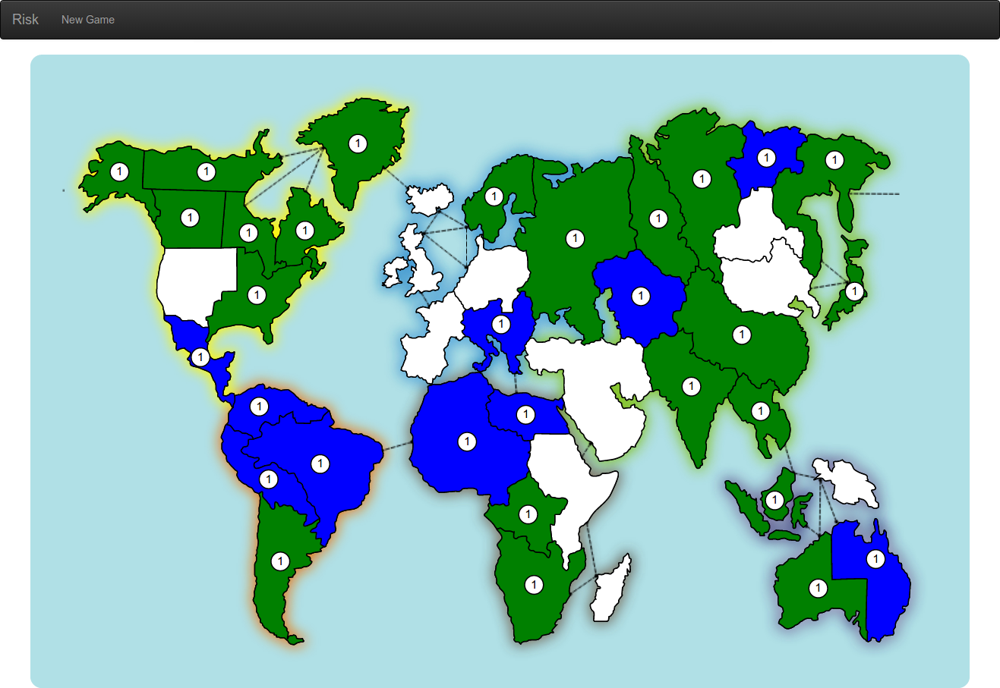

# Risk game rules

## Goal

Unlike the original [Risk game](http://en.wikipedia.org/wiki/Risk_%28game%29) there's only one way to win: **you have to conquer the whole world.**

## Start

A game can be started by anyone registered in the game. There must be between 2 and 6 players. If 6 players are registered the game starts automatically.

Once started the game enters the setup phase.

## Setup

This phase allows to distribute the countries to the players and to place armies on countries.

The number of armies to place by each player on their countries depends on the number of players:

| Number of players  | Number of armies |
| ---: | ---: |
|    2 |   40 |
|    3 |   35 |
|    4 |   30 |
|    5 |   25 |
|    6 |   20 |

Every country must contain at least one army. Then, turn by turn, the players place one of their remaining armies on one of their countries.

Because this phase can be a little long it is done automatically by the engine. The armies are randomly placed on countries.

Once all armies are placed the game can really start.

## Player turn

The players plays one after the other. The turn of one player contains 3 phases: _Reinforcement_, _Attack_ and _Fortification_

### Reinforcement

In this phase you get new armies to put on the map. The number of armies is computed from 2 factors:

- the number of territories owned. For every three countries, you get one army. For example, if you had 11 countries, you would receive 3 armies; if you had 22 countries, you would receive 7 armies.
- continent bonus: when you own all the territories of a continent you earn a bonus 

  | Continent  | Number of armies |
  | ------------- | ---: |
  | Asia          |    7 |
  | North America |    5 |
  | Europe        |    5 |
  | Africa        |    3 |
  | Australia     |    2 |
  | South America |    2 |
 
*Note*: if the amount of armies you would receive at the beginning of your turn is less than three, round up to three.

You place those armies on any of your territories.

Once done you can attack.

### Attack

This phase allows to attack other territories.

You can:
- only attack other territories that are adjacent to a territory you own or that are connected to you a territory you own by a sea-lane.
- attack any number of times from any one of your territories to any adjacent territory.

Attacking is optional. You may decide not to attack at all during a turn, only deploying armies.

Once done you can make a **fortification**.

#### Battle

A maximum of 3 armies are squared off to attack but at least one army must stay behind, because a territory must be occupied at all times. This number determines how many dices to roll for the attacker.  
A maximum of 2 armies are squared off from the attacked territory. This number determines how many dices to roll for the defender.

Dices are rolled, then:

- Match up the highest attacking dice with the highest defending dice, and match the second highest attacking dice with the second highest defending dice. If there is only one defending dice, only match up the highest attacking dice with the defending dice.
- Remove one army from the attacking territory if the defending dice is higher or equal to its corresponding attacking dice.
- Remove one army from the defending territory if the attacking dice is higher to its corresponding defending dice.

It's hard to understand? Here are examples:

| Attacking dices | Defending dices | Attacking loss | Defending loss |
| ----- | --- | --- | --- |
| 6,6,6 | 1,1 | 0 | 2 |
| 6,6,6 | 6,1 | 1 | 1 |
| 6,6,6 | 6,6 | 2 | 0 |
| 5,5   | 1   | 0 | 1 |
| 5,2   | 6,1 | 1 | 1 |
| 2     | 1,1 | 0 | 1 |
| 2     | 3,1 | 1 | 0 |
  
If the attacked territory have no army left it is conquered. You must move at least one army from the attacking territory to the conquered territory (there must be at least 1 army in every territory).

### Fortification

At the end of a turn you can make one last optional move of armies. This last move has to be done between two directly connected territories you own.

After this optional last move it's up to the next player to play.

## End of game

When there's only one player left he win the game.

## [Home](../README.md#code-lab-polymerdart) | [Step 3](step-3.md#step-3-risk-game)