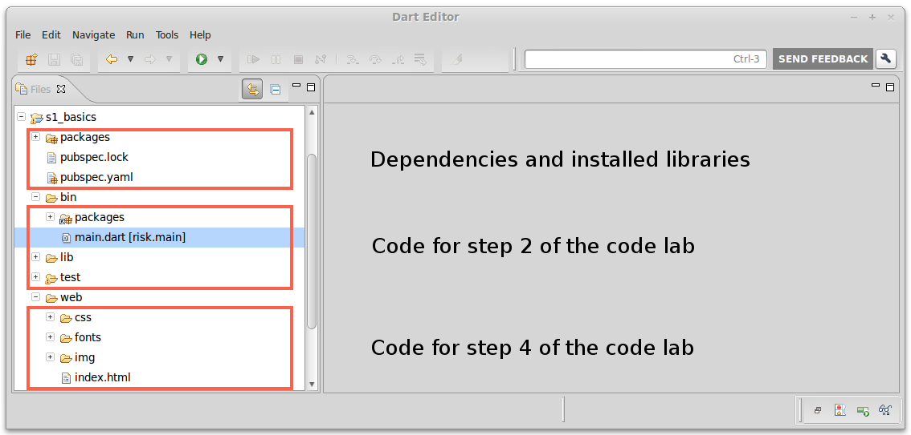
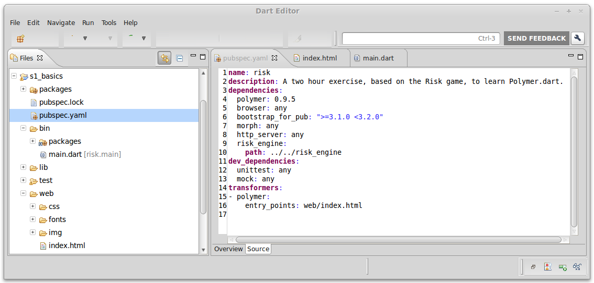
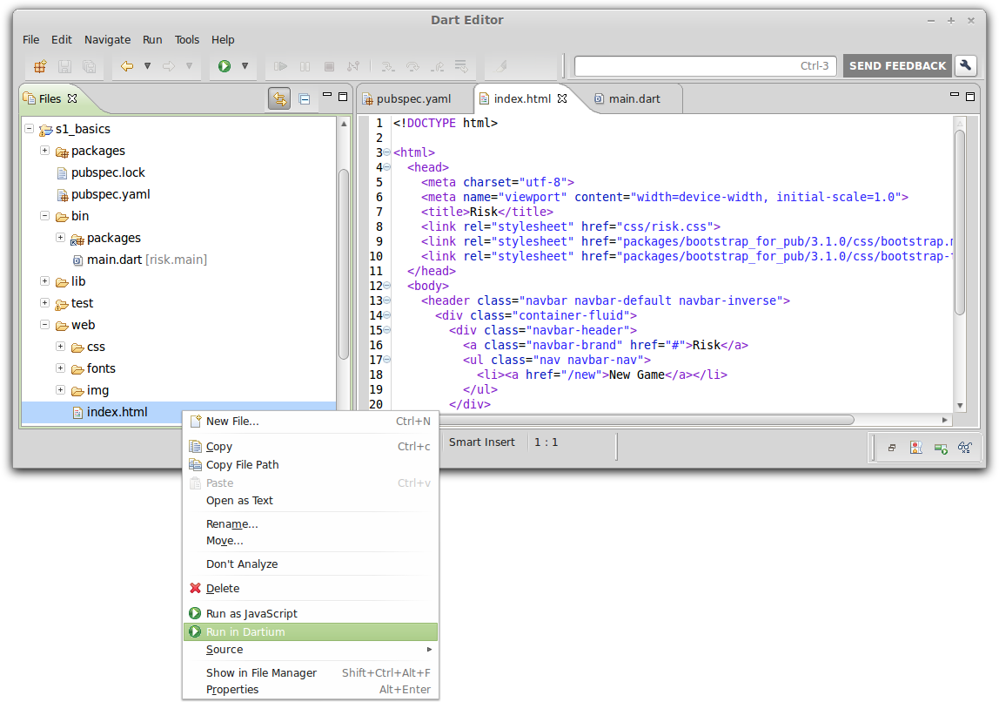

## Step 1: Run the app, and view its code

In this step, you open the source files for the first version of the
app under `ng-darrrt-codelab-master`.
After familiarizing yourself with the app's code,
you run the app.

_**Keywords**: main, pub, Dartium, Angular_


### Use Dart Editor to open the app's directory

&rarr;  In Dart Editor, use **File > Open Existing Folder...**
to open the directory `ng-darrrt-codelab-master/samples/s1-basics`.

&rarr;  Open the `web` directory by
clicking the little arrow ► to the left of its name.

.

<!-- PENDING: delete `img/fileview.png` -->


**Note:**
If you see red X’s
at the left of the filenames or if the `packages` directory doesn't appear,
the packages are not properly installed.
Right-click `pubspec.yaml` and select **Pub Get**.
(Do **not** use pub upgrade.
This code lab is tied to a specific version of AngularDart.)

### Open the app's source files

The initial app uses the following source files:
* `pubspec.yaml`: The app's description and dependencies, used by the Dart package manager
* `web/index.html`: The app's template
* `web/main.dart`: Custom app logic
* `web/piratebadge.css`: The app's appearance (we'll skip this for now)

&rarr;  In Dart Editor, open `pubspec.yaml` (in the top directory) by
double-clicking its filename.
To see its raw source code,
click the **Source** tab at the bottom of the edit view.

&rarr;  Still in Dart Editor,
under the `web` directory
double-click `index.html` and `main.dart`.



<!-- PENDING: delete `img/openfiles.png` -->

### Review the code

Get familiar with `pubspec.yaml`, and with the HTML and Dart code
for the skeleton version of the app.

#### pubspec.yaml

The `pubspec.yaml` file in the project root gives information
about this app and the packages it depends on.
In particular, the dependency on **angular** gives the Dart tools
the information they need to download the
[angular package](https://pub.dartlang.org/packages/angular).

``` yaml
name: s1_basics
description: A one hour exercise, based on the Darrrt project, to learn AngularDart.
dependencies:
  angular: 0.9.8
  browser: any
  js: any
  shadow_dom: any
  unittest: any
```

Key information:

* All AngularDart apps depend on `angular` and
  (to accommodate browsers that don't yet support Shadow DOM) `shadow_dom`.
* Like most Dart web apps, this app also depends on `browser`.
* Angular depends on other packages (including `browser`, as it happens).
  The pub package manager automatically finds the right versions of these packages.
* You can find many Dart packages, including angular,
  on [pub.dartlang.org](http://pub.dartlang.org/).
* For more information about the pub package manager, see the
  [pub documentation](https://www.dartlang.org/tools/pub/).


#### index.html

The first version of this HTML file contains no Angular code.
However, it does set you up to add Angular code in the next step.

```HTML
<html>
  <head>
    <meta charset="utf-8">
    <title>Pirate badge</title>
    <link rel="stylesheet" href="piratebadge.css">
  </head>
  <body>
    <h1>Pirate badge</h1>
    
    <div class="widgets">
      TO DO: Put the UI widgets here.
    </div>
    <div class="badge">
      <div class="greeting">
        Arrr! Me name is
      </div>
      <div class="name">
        <span id="badgeName"> </span>
      </div>
    </div>
    
    <script src="packages/shadow_dom/shadow_dom.min.js"></script>
    <script type="application/dart" src="main.dart"></script>
    <script src="packages/browser/dart.js"></script>
  </body>
</html>
```
Key information:
- The first `<script>` tag emulates Shadow DOM on browsers that don't support it natively.
- The second `<script>` tag identifies the main file that implements the app.
  Here, it’s the `main.dart` file.
- The `packages/browser/dart.js` script checks for native Dart support and
  either bootstraps the Dart VM or loads compiled JavaScript instead.

#### main.dart

This version of the app does nothing,
and has almost no Dart code.

```Dart
library s1_basics.main;

void main() {
  // Your app starts here.
}
```

Key information:
* This file contains the entry point for the app—the `main()` function.
  The `<script>` tags in the `index.html` file start the application
  by running this function.
* The `main()` function is a top-level function.
* A top-level variable or function is one that is declared outside
  a class definition.
* The `library` line isn't necessary now,
  but it will come in handy later when we add more Dart files to this app.
* By convention, library names begin with the package name (`s1_basics`),
  followed by a dot (`.`),
  followed by a library-specific name (`main`).

### Run the app in Dartium

&rarr; Right-click `index.html` and select **Run in Dartium**.

.

<!-- PENDING: delete `img/clickrun.png` -->

Dart Editor launches _Dartium_, a special build of Chromium that has the Dart Virtual Machine built in, and loads the `index.html` file.
The `index.html` file loads the app and calls the `main()` function.
You should see a TO DO comment on the left and a red and white name badge on the right.

<!-- Add screenshot? -->

## [Home](../README.md#code-lab-angulardart) | [< Previous](step-0.md#step-0-set-up) | [Next >](step-2.md#step-2-add-an-input-field)
