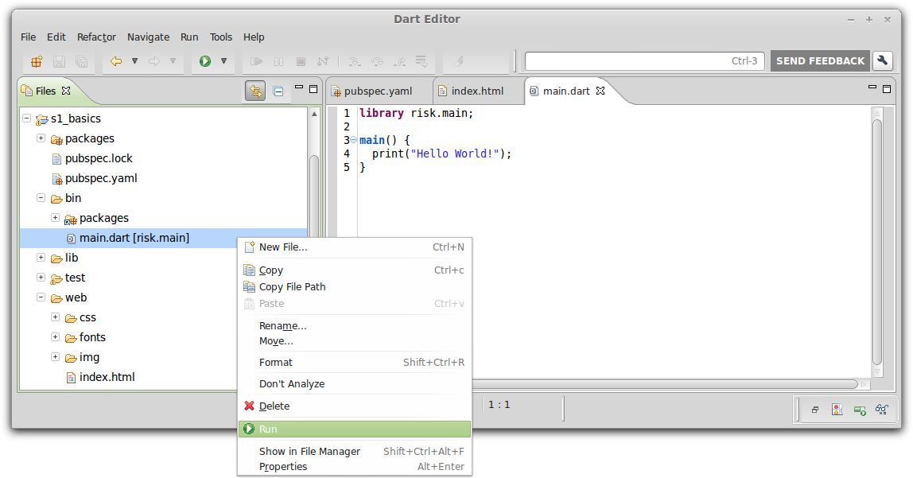

## Step 1: Run the app, and view its code

In this step, you open the source files for the first version of the
app under `risk-codelab-master`.
After familiarizing yourself with the app's code,
you run the app.

_**Keywords**: main, pub, Dartium, Polymer_


### Use Dart Editor to open the app's directories

&rarr;  In Dart Editor, use **File > Open Existing Folder...**
to open the directory `risk-codelab-master/samples/s1-basics`.

&rarr;  Open the `bin` and `web` directories by
clicking the little arrow ► to the left of their name.

.


**Note:**
If you see red X’s
at the left of the filenames or if the `packages` directory doesn't appear,
the packages are not properly installed.
Right-click `pubspec.yaml` and select **Pub Get**.
(Do **not** use pub upgrade.
This code lab is tied to a specific version of Polymer.dart.)

### Open the app's source files

The initial app uses the following source files:
* `pubspec.yaml`: The app's description and dependencies, used by the Dart package manager
* `packages`: This folder contains the dependencies defined in `pubspec.yaml` and grabbed by `pub get`. `pub` also grabs the transitive dependencies (dependencies needed by dependencies).
* `bin/main.dart`: The server app
* `lib/`: Public libraries shared between server and client app (we'll skip this for now)
* `test/`: The unit tests (we'll skip this for now)
* `web/index.html`: The web app's template
* `web/css`, `web/fonts`, `web/img` and `web/res`: The app's appearance (we'll skip this for now)

&rarr;  In Dart Editor, open `pubspec.yaml` (in the top directory) by
double-clicking its filename.
To see its raw source code,
click the **Source** tab at the bottom of the edit view.

&rarr;  Still in Dart Editor,
under the `web` directory
double-click `index.html` 
and under the `bin` directory 
double-click `main.dart`.


### Review the code

Get familiar with `pubspec.yaml`, and with the HTML and Dart code
for the skeleton version of the app.

#### pubspec.yaml

The `pubspec.yaml` file in the project root gives information
about this app and the packages it depends on.
In particular, the dependency on **polymer** gives the Dart tools
the information they need to download the
[polymer package](https://pub.dartlang.org/packages/polymer).

``` yaml
name: risk
description: A two hour exercise, based on the Risk game, to learn Polymer.dart.
dependencies:
  polymer: 0.9.5
  browser: any
  bootstrap_for_pub: ">=3.1.0 <3.2.0"
  morph: any
  http_server: any
  risk_engine:
    path: ../../risk_engine
dev_dependencies:
  unittest: any
  mock: any
transformers:
- polymer:
    entry_points: web/index.html
```

Key information:

* All Polymer.dart apps depend on `polymer`.
* Like most Dart web apps, this app also depends on `browser`.
* Polymer depends on other packages (including `browser`, as it happens).
  The pub package manager automatically finds the right versions of these packages.
* We provide some part of the game implementation in `risk_engine` to make this code lab easier for you ;)
* Building a server in Dart is very easy with `http_server` 
* The `transformers` section helps to build a deployable version of your app. 
* You can find many Dart packages, including polymer,
  on [pub.dartlang.org](http://pub.dartlang.org/).
* For more information about the pub package manager, see the
  [pub documentation](https://www.dartlang.org/tools/pub/).

#### web/index.html

The first version of this HTML file contains no Dart and no Polymer components.
However, it does set you up to add Polymer components among the next steps.

```HTML
<!DOCTYPE html>

<html>
  <head>
    <meta charset="utf-8">
    <meta name="viewport" content="width=device-width, initial-scale=1.0">
    <title>Risk</title>
    <link rel="stylesheet" href="css/risk.css">
    <link rel="stylesheet" href="packages/bootstrap_for_pub/3.1.0/css/bootstrap.min.css">
    <link rel="stylesheet" href="packages/bootstrap_for_pub/3.1.0/css/bootstrap-theme.min.css">
  </head>
  <body>
    <header class="navbar navbar-default navbar-inverse">
      <div class="container-fluid">
        <div class="navbar-header">
          <a class="navbar-brand" href="#">Risk</a>
          <ul class="nav navbar-nav">
            <li><a href="/new">New Game</a></li>
          </ul>
        </div>
      </div>
    </header>

    <div>
      TO DO: Put the UI widgets here.
    </div>
  </body>
</html>
```

#### bin/main.dart

This version of the server app does nothing, except printing `Hello World!` in the console.

```Dart
library risk.main;

main() {
  print("Hello World!");
}
```

Key information:
* This file contains the entry point for the server app—the `main()` function.
* The `main()` function is a top-level function.
* A top-level variable or function is one that is declared outside
  a class definition.
* The `library` line isn't necessary now,
  but it will come in handy later when we add more Dart files to this app.
* By convention, library names begin with the package name (`risk`),
  followed by a dot (`.`),
  followed by a library-specific name (`main`).

### Run the web app in Dartium

&rarr; Right-click `web/index.html` and select **Run in Dartium**.

.

Dart Editor launches _Dartium_, a special build of Chromium that has the Dart Virtual Machine built in, and loads the `index.html` file.  
You should see the _Risk_ navigation bar and a TO DO comment.

<!-- Add screenshot? -->

### Run the server app

&rarr; Right-click `bin/main.dart` and select **Run**.

.

Dart Editor launches `bin/main.dart` script as a standalone app.
Standard output is printed in a console window inside the IDE.  
You should see _Hello World!_.


## [Home](../README.md) | [< Previous](step-0.md#step-0-set-up) | [Next >](step-2.md#step-2-dart-classes)
