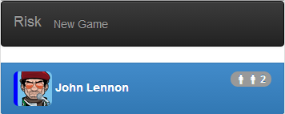
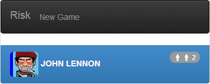
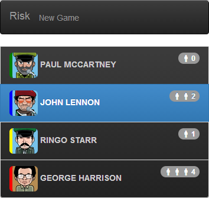

## Step 5: Polymer templates

In this step, you use more binding expressions, filter function and templates.

_**Keywords**: binding, filter function, conditional template, template loop_

### Create a `risk-players` element

Create a new custom element, as follows.

&rarr; Create a new file `web/players.html`.

```HTML
<!DOCTYPE html>

<polymer-element name="risk-players">
  <template>
    <link rel="stylesheet" href="css/risk.css">
    <link rel="stylesheet" href="packages/bootstrap_for_pub/3.1.0/css/bootstrap.min.css">
    <link rel="stylesheet" href="packages/bootstrap_for_pub/3.1.0/css/bootstrap-theme.min.css">

    <ul id="players" class="list-group list-group-inverse img-rounded">
      <li class="list-group-item">
        <!-- In the following tag, bind player avatar and color -->
        
        <!-- Bind here player name -->
        <span><b>Paul McCartney</b></span>
        <span class="badge pull-right">
          <i class="riskicon riskicon-soldier"></i>
          <i class="riskicon riskicon-soldier"></i>
          <!-- Bind here player reinforcement -->
          2
        </span>
      </li>
    </ul>
  </template>
  <script type="application/dart" src="players.dart"></script>
</polymer-element>
```

&rarr; Create a new file `web/players.dart`.

```Dart
import 'package:polymer/polymer.dart';
import 'package:risk_engine/risk_engine.dart';
import 'package:risk/risk.dart';

@CustomTag('risk-players')
class RiskPlayers extends PolymerElement {
  PlayerState player = new PlayerStateImpl(2, "John Lennon", "kadhafi.png", "blue", reinforcement: 2);

  RiskPlayers.created(): super.created();
}
```

&rarr; In the element template, bind the `player` fields to see his `name`, his `avatar`, his `color` and his `reinforcement` number. Follow this example:

```HTML
<span><b>{{player.name}}</b></span>
```

&rarr; Import this new component in `web/index.html` and use its tag.  
&rarr; Run in Dartium

You should see something like:

.

Key information:
* Properties on the model and in the scope are looked up via simple property names, like `{{player}}`. Property names are looked up first in the top-level variables, next in the model, then recursively in parent scopes. Properties on objects can be access with dot notation like `{{player.name}}`.
* Polymer expressions allow you to write complex binding expressions, with property access, function invocation, list/map indexing, and two-way filtering like.
* For more information about Polymer expressions, see the [Polymer expressions documentation](https://pub.dartlang.org/packages/polymer_expressions).

### Filter function

Filters let you change how your model data is displayed in the view without changing the model data itself. 
For example, they're useful for showing parts of a model's data, or displaying data in a particular format.
You can also easily create and use your own filters, as the following instructions show how to capitalize player name.

&rarr; Add a `capitalize` filter function in `web/players.dart`:

```Dart
class RiskPlayers extends PolymerElement {
  // ...
  String capitalize(String s) => s.toUpperCase();
  // ...
}
```

&rarr; Use it to capitalize the player `name` in `web/players.html`:

```HTML
<span><b>{{player.name | capitalize}}</b></span>
```

&rarr; Run in Dartium

You should see the capitalized player name:

.

Key information:
* A filter is a function that transforms a value into another, used via the pipe syntax: `value | filter`. Any function that takes exactly one argument can be used as a filter.
* The top-level function named `capitalize` is in the scope so if `player.name` is "John Lennon", then `person.name | capitalize` will have the value "JOHN LENNON".

### Conditional template

We want to display soldier icons in function of the number of player reinforcement:

- : if `reinforcement` is less or equal than `1`
- : if `reinforcement` is equal to `2`
- : if `reinforcement` is greater or equal than `3`

&rarr; In `web/players.html`, use conditional templates:

```HTML
<span class="badge pull-right">
  <i class="riskicon riskicon-soldier"></i>
  <!-- TODO complete the if expression -->
  <template if="{{ ... }}">
    <i class="riskicon riskicon-soldier"></i>
  </template>
  <!-- TODO complete the if expression -->
  <template if="{{ ... }}">
    <i class="riskicon riskicon-soldier"></i>
  </template>
  {{ player.reinforcement }}
</span>
```

&rarr; Complete the `if` conditions with the right expressions.  
&rarr; Run in Dartium, and try to change the value of player `reinforcement`.

Key information:
* Control the UI with declarative conditional `if` templates.
* Template conditionals are part of the data binding infrastructure. If `player.reinforcement` changes, the templates are automatically re-evaluated.

### Template loop

We want to display a list of players.

&rarr; In `web/players.dart`, remove the `player` field and add two new published fields, `players` and `activePlayerId`:

```Dart
class RiskPlayers extends PolymerElement {
  // We don't need player field anymore
  // PlayerState player = new PlayerStateImpl(2, "John Lennon", "kadhafi.png", "blue", reinforcement: 2);

  @published
  Iterable<PlayerState> players = [
    new PlayerStateImpl(1, "Paul McCartney", "castro.png", "green", reinforcement: 0),
    new PlayerStateImpl(2, "John Lennon", "kadhafi.png", "blue", reinforcement: 2),
    new PlayerStateImpl(3, "Ringo Starr", "staline.png", "yellow", reinforcement: 1),
    new PlayerStateImpl(4, "George Harrison", "kim-jong-il.png", "red", reinforcement: 4),
  ];

  @published
  int activePlayerId = 2;
  // ...
}
```

&rarr; In `web/players.html`, use conditional loop to iterate over `players`:

```HTML
<ul id="players" class="list-group list-group-inverse img-rounded">
  <template repeat="{{ player in players }}">
    <!-- Complete the following tokenList filter to enable `active` class if it is the active player -->
    <li class="list-group-item {{ {'active': ...} }}">
      <!-- ... -->
    </li>
  </template>
</ul>
```

&rarr; Complete the [`tokenList` filter](http://www.polymer-project.org/docs/polymer/filters.html#tokenlist) to enable `active` class if it is the active player in function of `activePlayerId` value.  
&rarr; Run in Dartium.

You should see something like:

.

Key information:
* `{{ player in players }}` loops through a collection, instantiating a template for every item in the collection.
* Template loops are part of the data binding infrastructure. If an item is added or removed from `players`, the contents of `<ul>` are automatically updated.
* The `tokenList` filter is useful for binding to the class attribute. It allows you to dynamically set/remove class names based on the object passed to it. If the object key is truthy, the name will be applied as a class.

### Learn more
 - [Polymer.dart](https://www.dartlang.org/polymer-dart/)
 - [Polymer expressions](https://pub.dartlang.org/packages/polymer_expressions)
 
### Problems?
Check your code against the files in [s5_template](../samples/s5_template).

## [Home](../README.md) | [< Previous](step-4.md) | [Next >](step-6.md)
