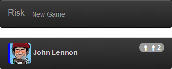

## Step 5: Polymer templates

In this step, ...

_**Keywords**: ..._

### Create a `risk-players` element

Create a new custom element, as follows.

&rarr; Create a new file `web/players.html`.

```HTML
<!DOCTYPE html>

<polymer-element name="risk-players">
  <template>
    <link rel="stylesheet" href="css/risk.css">
    <link rel="stylesheet" href="packages/bootstrap_for_pub/3.1.0/css/bootstrap.min.css">
    <link rel="stylesheet" href="packages/bootstrap_for_pub/3.1.0/css/bootstrap-theme.min.css">

    <ul id="players" class="list-group list-group-inverse img-rounded">
      <li class="list-group-item">
        
        <span><b>Paul McCartney</b></span>
        <span class="badge pull-right">
          <i class="riskicon riskicon-soldier"></i>
          <i class="riskicon riskicon-soldier"></i>
          2
        </span>
      </li>
    </ul>
  </template>
  <script type="application/dart" src="players.dart"></script>
</polymer-element>
```

&rarr; Create a new file `web/players.dart`.

```Dart
import 'package:polymer/polymer.dart';
import 'package:risk_engine/risk_engine.dart';
import 'package:risk/risk.dart';

@CustomTag('risk-players')
class RiskPlayers extends PolymerElement {
  PlayerState player = new PlayerStateImpl(2, "John Lennon", "kadhafi.png", "blue", reinforcement: 2);

  RiskPlayers.created(): super.created();
}
```

&rarr; In the element template, bind the `player` fields to see his `name`, his `avatar`, his `color` and his `reinforcement` number. Follow this example:

```HTML
<span><b>{{player.name}}</b></span>
```

&rarr; Import this new component in `web/index.html` use its tag.  
&rarr; Run in Dartium

You should see something like:

.

Key information:
* [Polymer expressions](https://pub.dartlang.org/packages/polymer_expressions) allow you to write complex binding expressions, with property access, function invocation, list/map indexing, and two-way filtering like.
* `{{player.name}}` ...

### Learn more
 - [Polymer.dart](https://www.dartlang.org/polymer-dart/)
 - [Polymer expressions](https://pub.dartlang.org/packages/polymer_expressions)
 
### Problems?
Check your code against the files in [s5_template](../samples/s5_template).

## [Home](../README.md) | [< Previous](step-4.md) | [Next >](step-6.md)
