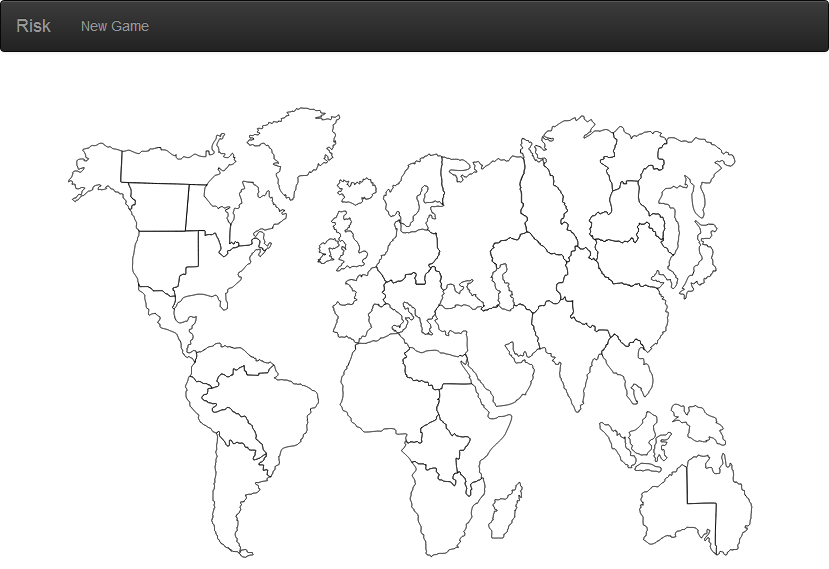
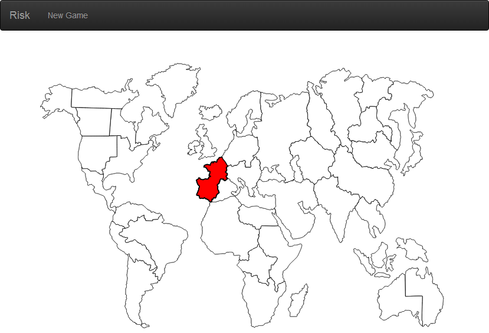
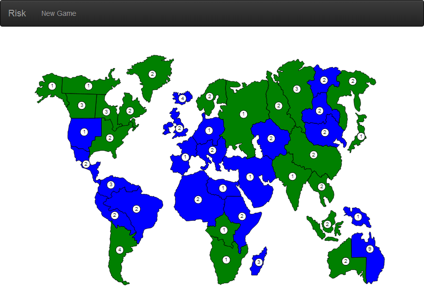
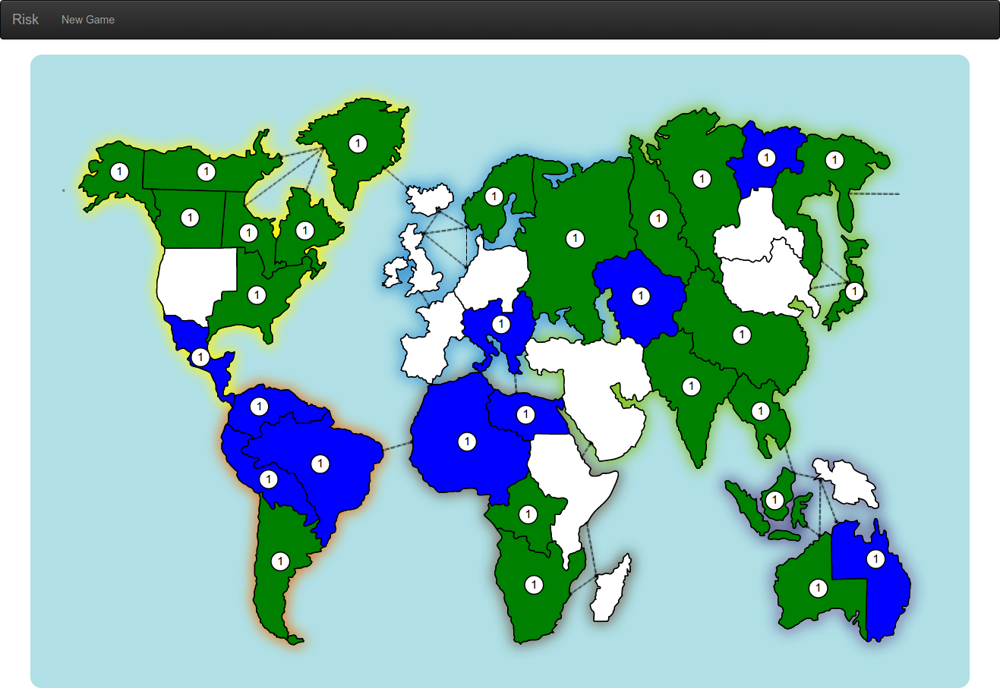
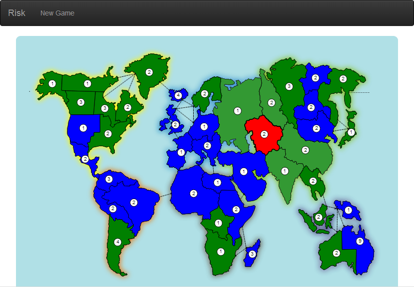

## Step 6: Risk board

In this step, you build a board map updated by the game state model.

_**Keywords**: SVG, HttpRequest, Future, event handler_

### Create a `risk-players` element

Create a new custom element, as follows.

&rarr; Create a new file `web/board.html`, with the following content:

```HTML
<!DOCTYPE html>

<polymer-element name="risk-board">
  <template>
    <link rel="stylesheet" href="css/risk.css">
    <style>
      .country {
        stroke: black;
        stroke-width: 1;
      }

      .country:hover {
        stroke-width: 2;
      }

      .selected .country {
        stroke-width: 2;
        fill: red;
      }

      .selectable {
        cursor: pointer;
      }

      .selectable .country {
        animation-duration: 1s;
        animation-name: highlight;
        animation-iteration-count: infinite;
        animation-direction: alternate;
      }
    </style>
    <svg xmlns="http://www.w3.org/2000/svg" xmlns:xlink="http://www.w3.org/1999/xlink"
      viewBox="0 0 800 540" width="100%" height="90%">
      
      <!-- TODO: iterate here to display country contours -->
      
    </svg>
  </template>
  <script type="application/dart" src="board.dart"></script>
</polymer-element>

```

&rarr; Create a new file `web/board.dart`, with the following content:

```Dart
import 'dart:convert';
import 'dart:html';

import 'package:polymer/polymer.dart';
import 'package:risk/risk.dart';
import 'package:risk_engine/client.dart';
import 'package:risk_engine/snapshot.dart';

@CustomTag('risk-board')
class RiskBoard extends PolymerElement {
  @observable
  Map<String, Map> paths;

  RiskBoard.created(): super.created() {
    HttpRequest.getString('res/country-paths.json').then(JSON.decode).then((e) => paths = e);
  }
}
```

Key information:
* Styles are already defined: `country`, `selected`, `selectable` define specific appearance on the country contours when the mouse is over, or when the country is selected or selectable.
* In the `RiskBoard.created()` constructor, country data are read from a json file. This file contains country contour paths and optimal center.
  * `HttpRequest` is a utility for retrieving data from a URL.
  * `getString()` is a convenience method for doing a simple GET request that returns a string.
  * The code uses a `Future` to perform the GET asynchronously.
  * The callback function for `.then()` is called when the Future completes successfully.
  * When the `Future` completes successfully, the json content is read then set to the `paths` field.
* `@observable` specifies that `paths` is an observable property for use in Model-Driven-Views (MDV). Updates to the model are reflected in the DOM and user input into the DOM is immediately assigned to the model.

### Draw country contours

&rarr; Have a look to the loaded json file `web/res/country-paths.json`:

```Json
{
  "eastern_australia": {
    "path": "M 682.08791,409.72925 C ...",
    "center": {
      "x": 720,
      "y": 430
    }
  },
  "indonesia": { ... },
  ...
}
```

The first level key, e.g. `eastern_australia`, is the `countryId`. Its value contains data about the country:
* `path` is the country contour path.
* `center` is the coordinates of the optimal center. Later in this step, we will display armies number at this position.

&rarr; Use a template loop to iterate over the `countryId in paths.keys` with the following template:

```HTML
<g>
  <path class="country" d="{{ paths[countryId]['path'] }}" fill="white"></path>
</g>
```

&rarr; Import this new component in `web/index.html` and use its tag.  
&rarr; Run in Dartium

You should see something like the following screenshot and mouse over on a country should increase its stroke width:

.

Key information:
* List and Map like objects can be accessed via the index operator: `[]`.
* Unlike JavaScript, list and map contents are not generally available via property access. That is, the previous examples are not equivalent to `paths.indonesia.path`. This ensures that access to properties and methods on Lists and Maps is preserved.

### Click on country

&rarr; In `web/board.dart`, add a new `selectedCountryId` field.  
&rarr; Add a click handler that sets the `selectedCountryId` to the clicked country id:

```Dart
class RiskBoard extends PolymerElement {
  // ...
  @observable
  String selectedCountryId;

  countrySelect(Event e, var detail, Element target) {
    selectedCountryId = target.dataset['country'];
  }
  // ...
}
```

&rarr; In `web/board.html`, bind `countrySelect` handler to the `on-click` event.  
&rarr; Complete `class` binding to add `selected` CSS class if the country is selected.

```HTML
<g on-click="{{ countrySelect }}" data-country="{{ countryId }}" 
  class="{{ ... }}">
  <path class="country" d="{{ paths[countryId]['path'] }}" fill="white"></path>
</g>
```

&rarr; Run in Dartium

You should be able to select a country when clicking on it:

.

Key information:
* An event handler is a three parameter method defined in the custom element class (See  [Event Handlers](https://www.dartlang.org/docs/tutorials/polymer-intro/#event-handlers))  
  `myEventHandler(Event e, var detail, Element target)`
  - An `Event` that contains information about the event, such as its type and when it occurred.
  - The `detail` object can provide additional, event-specific information.
  - The `Element` that fired the event.
* `data-country` is an custom data attribute. [Element.dataset](https://api.dartlang.org/docs/channels/stable/latest/dart_html/Element.html#dataset) allows access to all custom data attributes (data-*) set on this element.

### Display player colors and armies in place

&rarr; In `web/board.dart`, add a new published `game` field.  
&rarr; Implement a function `color` that returns the player color:

```Dart
class RiskBoard extends PolymerElement {
  // ...
  @published
  RiskGameState game = loadEventsSync(new RiskGameStateImpl(), SNAPSHOT_GAME_ATTACK);

  // TODO: return the player color, white if the playerId is null
  String color(int playerId) => "white";
  // ...
}
```

&rarr; In `web/board.html`, bind `fill` attribute with player color who own the country.  
&rarr; Complete `class` binding to add `selected` CSS class if the country is selected.

```HTML
<g on-click="{{ countrySelect }}" data-country="{{ countryId }}"
  class="{{ {'selected': countryId == selectedCountryId} }}">
  <path class="country" d="{{ paths[countryId]['path'] }}" 
    fill="{{ color(game.countries[countryId].playerId) }}"></path>
  <!-- Armies number -->
  <g transform="translate({{ paths[countryId]['center']['x'] }}, {{ paths[countryId]['center']['y'] }})">
    <circle cx="0" cy="0" r="8" stroke="black" stroke-width="1" fill="white" />
    <!-- TODO: complete binding to get country armies number -->
    <text text-anchor="middle" font-size="10" x="0" y="3">{{ ... }}</text>
  </g>
</g>
```
&rarr; Run in Dartium

You should see something like:

.

Key information:
* `loadEventsSync(new RiskGameStateImpl(), SNAPSHOT_GAME_ATTACK)` loads a game state from the events history `SNAPSHOT_GAME_ATTACK` synchronously. 
  It means that the instance of `RiskGameStateImpl` is completely updated with the events history when the `game` field is instantiated.

### Events stream

During the game, the instance `RiskGameState` will be continuously updated by an event stream coming from server game engine.

&rarr; To simulate an incoming event stream, change the `loadEventsSync` call by the call of `loadEventsAsync`:

```Dart
RiskGameState game = loadEventsAsync(new RiskGameStateImpl(), SNAPSHOT_GAME_ATTACK);
```

&rarr; Run in Dartium

The map countries should stay blank. In deed, `@published` or `@observable` annotations do not observe deeply in the instance, only the changes of the variable.
To be able to observe the fields changes in the object, we have to update the models as follows:

&rarr; Edit `lib/risk.dart` and add a new import:

```Dart
import 'package:observe/observe.dart';
```

&rarr; Edit `lib/src/game.dart` and make `CountryStateImpl`, `PlayerStateImpl` and `RiskGameStateImpl` observable:

```Dart
class CountryStateImpl extends Object with Observable implements CountryState {
  final String countryId;
  @observable int playerId;
  @observable int armies;
  // ...
}

class PlayerStateImpl extends Object with Observable implements PlayerState {
  final int playerId;
  String name;
  String avatar;
  String color;
  @observable int reinforcement;
  @observable bool dead;

  // ...
}

class RiskGameStateImpl extends Object with Observable implements RiskGameState {
  Map<String, CountryStateImpl> countries = toObservable({});
  Map<int, PlayerStateImpl> players = toObservable({});
  @observable List<int> playersOrder = [];
  @observable int activePlayerId;

  @observable bool started = false;
  @observable bool setupPhase = false;
  @observable String turnStep;

  List<EngineEvent> events = toObservable([]);

  void update(EngineEvent event) {
      // ...

      // Because of a bug in ObservableMap, workaround for now before the fix https://codereview.chromium.org/213743012/
      notifyPropertyChange(#countries, {}, countries);
      notifyPropertyChange(#players, {}, players);
  }
  // ...
}
```
&rarr; Run in Dartium

You should see progressively the board updated:

.

Key information:
* `loadEventsSync(new RiskGameStateImpl(), SNAPSHOT_GAME_ATTACK)` loads a game state from the events history `SNAPSHOT_GAME_ATTACK` asynchronously. It sends a new event to the game state every 50ms.
  It means that the instance of `RiskGameStateImpl` is updated on a continuous-flow of events.
* `Observable` represents an object with observable properties. This is used by data in model-view architectures to notify interested parties of changes to the object's properties (fields or getter/setter pairs). The `with` clause is the way to do [Mixins](https://www.dartlang.org/articles/mixins/) in Dart.
* `toObservable()` converts the `List` or `Map` to an `ObservableList` or `ObservableMap`, respectively. This is a convenience function to make it easier to convert literals into the corresponding observable collection type.
* `notifyPropertyChange` notifies that a field of the object has been changed.
* All fields that are suppposed to change during the game (particularly in `RiskGameStateImpl.update` function) are marked with the `@observable`annotation. So updates to the model are reflected in the DOM.

### Selectable and complex logic

To make this exercise easier, we provide to you the complex logic in a class to extend. It brings selectable and click logic.

Edit `web/board.dart` and `web/board.html`, as follows:

&rarr; In `web/board.dart`, extend the element with the given `AbstractRiskBoardElement` class:

```Dart
class RiskBoard extends AbstractRiskBoardElement {
  // ...
}
```

&rarr; In `web/board.html`, copy and paste the following code:

```HTML
<svg xmlns="http://www.w3.org/2000/svg" xmlns:xlink="http://www.w3.org/1999/xlink"
  viewBox="0 0 800 540" width="100%" height="90%">
  <!-- Background image -->
  <image xlink:href="img/board.svg" width="100%" height="100%" />

  <template repeat="{{ countryId in paths.keys }}">
    <g on-click="{{ countryClick }}" data-country="{{ countryId }}"
      class="{{ {'selected': countryId == selectedCountryId, 'selectable': selectableCountry(countryId, game.activePlayerId, game.turnStep, selectedCountryId)} }}">
      <path class="country" d="{{ paths[countryId]['path'] }}"
        fill="{{ color(game.countries[countryId].playerId) }}">
      </path>
      <!-- Armies number -->
      <template if="{{ game.countries[countryId].armies > 0 }}">
        <g transform="translate({{ paths[countryId]['center']['x'] }},{{ paths[countryId]['center']['y'] }})">
          <circle cx="0" cy="0" r="8" stroke="black" stroke-width="1" fill="white" />
          <text text-anchor="middle" font-size="10" x="0" y="3">{{ game.countries[countryId].armies }}</text>
        </g>
      </template>
    </g>
  </template>
</svg>
```
&rarr; Run in Dartium

You should see something like with highlighted selectable countries:

.

Key information:
* `<image xlink:href="img/board.svg" ... />` is a background image that adds sea-lane and colored continent shadow.
* `countryClick` now handles country click. It has more logic depending on the game state and selected country.
* `selectable` highlights selectable countries depending on the game state and selected country.

### Learn more
 - [Polymer.dart](https://www.dartlang.org/polymer-dart/)
 - [Polymer expressions](https://pub.dartlang.org/packages/polymer_expressions)
 
### Problems?
Check your code against the files in [s6_board](../samples/s6_board).

## [Home](../README.md) | [< Previous](step-5.md) | [Next >](step-7.md)
