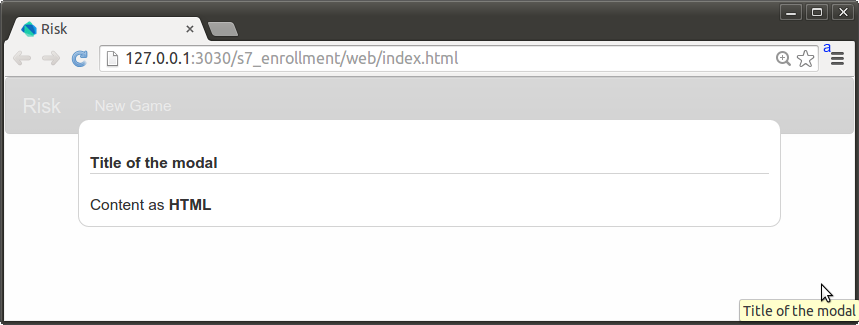
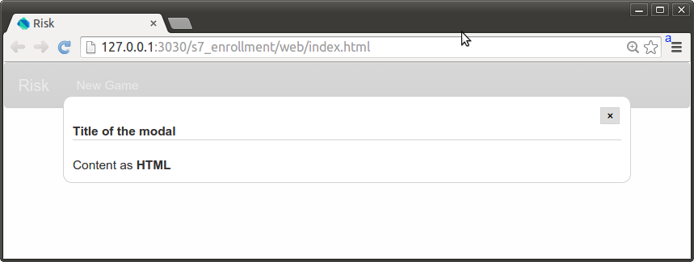
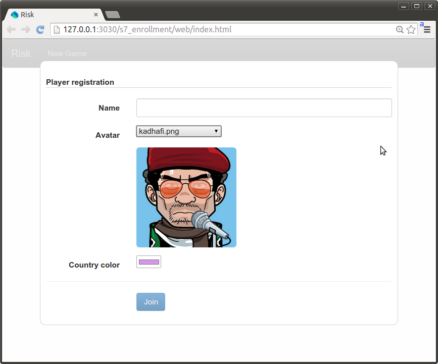

## Step 7: Player enrollment

In this step, you build a registration form displayed in a modal panel.

_**Keywords**: form, data-binding, custom events_

### Create a game component

This component will further contain all the components binded together to make the game work. For now you will use it to test the components you will create in this step.

&rarr; Create a new file `web/game.html`, with the following content:

```html
<!DOCTYPE html>

<polymer-element name="risk-game">
  <template>
  </template>

  <script type="application/dart" src="game.dart"></script>
</polymer-element>

```

&rarr; Create a new file `web/game.dart`, with the following content:

```dart
import 'package:polymer/polymer.dart';

@CustomTag('risk-game')
class RiskGame extends PolymerElement {
  RiskGame.created() : super.created();
}
```

&rarr; In `web/index.html` add a `<risk-game>`:

```html
<link rel="import" href="game.html">
<!-- .... -->
<risk-game></risk-game>
```

### Create a modal panel

The registration form will appear in a modal panel. We will first create a `<risk-modal>` element that will allow to display some contents in a modal panel.

#### Basic modal panel

&rarr; Create a new file `web/modal.html`, with the following content:

```HTML
<!DOCTYPE html>

<polymer-element name="risk-modal">
  <template>
    <style>
      :host {
        position: fixed;
        top: 0;
        bottom: 0;
        right: 0;
        left: 0;
        z-index: 1000;
        background-color: rgba(256,256,256,0.8);
      }

      #title {
        border-bottom: 1px solid lightgray;
      }

      #panel {
        background-color: white;
        border: 1px solid lightgray;
        border-radius: 10px;
        padding: 10px;
        width: 80%;
        max-width: 768px;
        margin: 5% auto 0;
        max-height: 80%;
        overflow-x: hidden;
        overflow-y: auto;
      }

      #close {
        float: right;
        border: 1px solid lightgray;
      }
    </style>

    <div id="panel">
      <h4 id="title">{{ title }}</h4>
      <content></content>
    </div>
  </template>
  <script type="application/dart" src="modal.dart"></script>
</polymer-element>
```

&rarr; Create a new file `web/modal.dart`, with the following content:

```Dart
import 'package:polymer/polymer.dart';

@CustomTag('risk-modal')
class RiskModal extends PolymerElement {
  @published
  String title;

  RiskModal.created(): super.created();
}
```

Key information:
* The `<content>` tag allows to inject the content provided inside `<risk-modal></risk-modal>`. This `<content>` may also accept a `select` attribute to only grab some specific parts of the original HTML content.

&rarr; Use this new component in `web/game.html` to display some basic text:

```html
<link rel="import" href="modal.html">
<!-- .... -->
<risk-modal title="Title of the modal">Content as <b>HTML</b></risk-modal>
```

&rarr; Run in Dartium

You should see a modal panel with the title you provided and the original content displayed.



#### Closable modal panel

You will now improve the modal panel to allow it to be closable.

&rarr; In `web/modal.html` replace the `<div id="panel">` with the following:

```html
    <div id="panel">
      <template if="{{ closable }}">
        <button id="close" on-click="{{ close }}">&times;</button>
      </template>
      <h4 id="title">{{ title }}</h4>
      <content></content>
    </div>
```

&rarr; In `web/modal.dart` add the following members:

```dart
  @published
  bool closable;

  // ....

  close() => fire('close');
```

Key information:
* The `<risk-modal>` element can now be closable or not depending on its `closable` attribute.
* By clicking on the _close button_ a [CustomEvent](https://api.dartlang.org/apidocs/channels/stable/dartdoc-viewer/dart-dom-html.CustomEvent) will be fired on the element. This event can be handled outside of the element with: `<risk-modal on-close="...">`.

To test this new behaviour add `closable="{{ true }}" on-close="{{ close }}"` in `web/game.html` and `close(CustomEvent e, var detail, Element target) => target.remove();` in `web/game.dart`. Run in Dartium.



### Create a basic registration form

&rarr; Create a new file `web/registration.html`, with the following content:

```html
<!DOCTYPE html>

<polymer-element name="risk-registration">
  <template>
    <link rel="stylesheet" href="packages/bootstrap_for_pub/3.1.0/css/bootstrap.min.css">
    <link rel="stylesheet" href="packages/bootstrap_for_pub/3.1.0/css/bootstrap-theme.min.css">

    <div class="form-horizontal">
      <div class="form-group">
        <label class="col-sm-3 control-label">Name</label>
        <div class="col-sm-9">
          <input class="form-control" value="{{ name }}">
        </div>
      </div>
      <div class="form-group">
        <label class="col-sm-3 control-label">Avatar</label>
        <div class="col-sm-9">
          <select selectedIndex="{{ avatarSelectedIndex }}">
            <option template repeat="{{ avatar in avatars }}">{{ avatar }}</option>
          </select>
          <br>
          <br>
          
        </div>
      </div>
      <div class="form-group">
        <label class="col-sm-3 control-label">Country color</label>
        <div class="col-sm-9">
          <input type="color" value="{{ color }}">
        </div>
      </div>
      <hr>
      <div class="form-group">
        <div class="col-sm-offset-3 col-sm-9">
          <button class="btn btn-primary">Join</button>
        </div>
      </div>
    </div>

  </template>
  <script type="application/dart" src="registration.dart"></script>
</polymer-element>
```

&rarr; Create a new file `web/registration.dart`, with the following content:

```dart
import 'dart:math';
import 'package:polymer/polymer.dart';

final _random = new Random();

@CustomTag('risk-registration')
class RiskRegistration extends PolymerElement {
  final List<String> avatars = ['ahmadi-nejad.png', 'bachar-el-assad.png',
      'caesar.png', 'castro.png', 'hitler.png', 'kadhafi.png', 'kim-jong-il.png',
      'mao-zedong.png', 'mussolini.png', 'napoleon.png', 'pinochet.png',
      'saddam-hussein.png', 'staline.png'];

  @observable
  String name;

  @observable
  String avatar;

  @observable
  String color;

  RiskRegistration.created(): super.created() {
    avatar = (avatars.toList()..shuffle(_random)).first;
    color = '#' + new List.generate(6, (_) => (6 + _random.nextInt(10)).toInt(
        ).toRadixString(16)).join();
  }

  int get avatarSelectedIndex => avatars.indexOf(avatar);
  set avatarSelectedIndex(int index) {
    avatar = avatars[index];
  }
}

```

&rarr; Use this new `<risk-registration>` in `web/game.html`:

```html
    <link rel="import" href="registration.html">
    <!-- .... -->
    <risk-modal title="Player registration">
      <risk-registration></risk-registration>
    </risk-modal>
```

&rarr; Run in Dartium.



Key information:
* The two-way data binding makes forms really easy to handle. Any change in the input is reflected directly on the property of the class.
* `<select>` binding is done with its `selectedIndex` attribute. The `get avatarSelectedIndex`/`set avatarSelectedIndex` are used for translation between selectedIndex and value.
* `<option>` elements use a specific syntax for repeat: `<option template repeat="{{ avatar in avatars }}"` instead of `<template repeat="{{ avatar in avatars }}"><option>{{ avatar }}</option></template>`. Some elements (like `<option>`, `<tr>`, `<td>`) have parsing rules that prohibit a `<template>` tag.

### Add validation

To improve the form submission you will enable the _Join_ button only when all the informations are provided.

&rarr; In `web/registration.html` replace the _Join_ button with the following code:

```html
<button class="btn btn-primary" disabled?="{{ !isValid }}">Join</button>
```

&rarr; In `web/registration.dart` add the following code :

```dart
class RiskRegistration extends PolymerElement {

  // .....

  RiskRegistration.created(): super.created() {
    // .....

    // notif isValid change
    notifyIsValid() => notifyPropertyChange(#isValid, null, isValid);
    onPropertyChange(this, #name, notifyIsValid);
    onPropertyChange(this, #avatar, notifyIsValid);
    onPropertyChange(this, #color, notifyIsValid);
  }

  // .....

  bool get isValid => [name, avatar, color].every((v) => v != null && v.trim(
      ).isNotEmpty);
}
```

&rarr; Run in Dartium.

Key information:
* The `?=` syntax in `disabled?="{{ !isValid }}"` allows to make the presence of `disabled` conditionnal to the expression provided.
* `#name` is equivalent to `const Symbol('name')`. A [Symbol](https://api.dartlang.org/apidocs/channels/stable/dartdoc-viewer/dart-core.Symbol) object represents an operator or identifier declared in a Dart program (mainly needed for minification).
* [onPropertyChange](https://api.dartlang.org/apidocs/channels/stable/dartdoc-viewer/observe/observe#id_onPropertyChange) is used to observe changes on a particular member and to trigger actions.
* [notifyPropertyChange](https://api.dartlang.org/apidocs/channels/stable/dartdoc-viewer/observe/observe.Observable#id_notifyPropertyChange) is used to inform that the field name of this object has been changed.
* `notifyIsValid` is an inline function only available in the constructor. It's like defining `var notifyIsValid = () => notifyPropertyChange(#isValid, null, isValid);`.

### Submitting form

&rarr; In `web/registration.html` add ` on-click="{{ join }}"` to the _Join_ button.

&rarr; In `web/registration.dart` add the following `join` method that will be called on _Join_ click:

```dart
  join() => fire('done', detail: {
    'name': name,
    'avatar': avatar,
    'color': color,
  });
```

Unlike the `close` event fired by `<risk-modal>` this `done` event comes with additionnal informations. The optional named parameter `detail` allows to pass any kind of contextual datas associated with the event.

&rarr; In `web/game.html` add `on-done='{{ joinGame }}'` and implement `joinGame` in `web.game.dart` to print the detail in the console.

### Problems?
Check your code against the files in [s7_enrollment](../samples/s7_enrollment).

## [Home](../README.md#code-lab-polymerdart) | [< Previous](step-6.md#step-6-risk-board) | [Next >](step-8.md#step-8-event-serialization)

